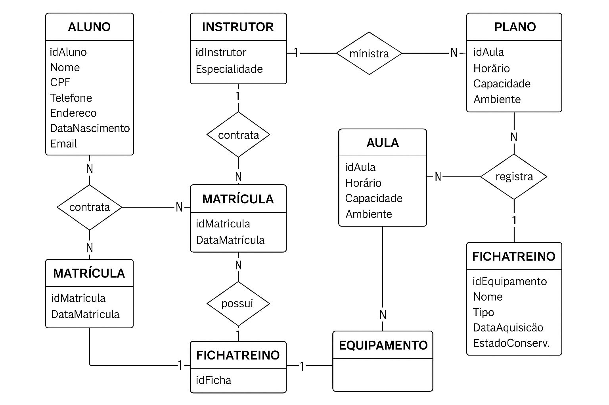

# Sistema de Gestão de Academia (SGA)

Bem-vindo ao projeto.

Como executar 

Abra o pgAdmin e conecte-se ao servidor PostgreSQL.

Crie um novo banco de dados (ex.: sga_db).

No banco criado, use a opção Query Tool.

Abra e execute schema.sql → aguarde criação das tabelas.

Em seguida, execute inserts.sql para povoar os dados.

Execute queries.sql e updates_deletes.sql para testes.

## 📌 Scripts SQL
- [schema.sql](schema.sql)
- [inserts.sql](inserts.sql)
- [queries.sql](queries.sql)
- [updates_deletes.sql](updates_deletes.sql)

## 📌 DER

